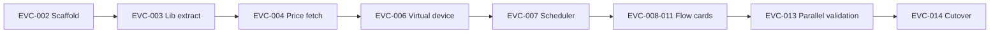

# EV Charger — fra HomeyScript til Homey Pro App

## Formål

Konvertere `Homey/EVCharger.js` (~1125 linjer HomeyScript) til en **Homey Pro App** (SDK 3) der kører stabilt på **Homey Pro 13.3.0**, uden at miste den eksisterende 15-minutters spotpris-optimering.

## Nuværende løsning (HomeyScript)

### Hvad scriptet gør

| Område | Adfærd |
|--------|--------|
| **Prisdata** | Henter kvarterspriser fra Energi Data Service (primær) og Strømligning (fallback, 1h→15m expansion) |
| **Dagvindue** | 09:00–17:00 — lad hvis spot < 0,30 kr/kWh inkl. moms, ellers vælg N billigste 15-min slots |
| **Nattevindue** | 21:00–06:00 — samme 15-min logik |
| **ChargeHours** | Antal *ladetimer* (ikke kalendertimer); 3 timer = 12 kvarter |
| **forceCharge** | Dagoverride (09–17): lad kontinuerligt uanset pris |
| **oneShotCharge** | Engangsopladning: vælg billigste slots før deadline (`oneShotReadyBy`) |
| **Output** | `charge_now`, `charge_message`, `charge_schedule` via Homey Logic-variabler |
| **Ekstra** | Opvaskemaskine-hint (`findCheapestDishwasherSlot`), notifikation ved API-fejl |

### Afhængigheder i dag

```
Flow (cron ~15 min)
  → HomeyScript EVCharger.js
    → Energi Data Service / Strømligning API
    → Homey Logic (forceCharge, ChargeHours, oneShot*, charge_now, charge_message)
  → Flow læser charge_now → styrer Easee/lader
  → SendEVWebhook.js → Home Assistant webhook (valgfrit)
```

### Begrænsninger ved HomeyScript

| Problem | Konsekvens |
|---------|------------|
| Ingen persistent app-state | Alt konfigureres via Logic-variabler |
| Kører kun når Flow/script trigges | Kræver ekstern cron-Flow |
| Svær at teste | Ingen modulær struktur, ingen unit tests |
| Ingen app-indstillinger | API-nøgler og parametre i Logic |
| Begrænset Flow-integration | `Homey.flow.runFlowCardAction` som workaround for notifikationer |
| Ingen versionering/deploy | Manuelt copy/paste i HomeyScript-editor |

## Målarkitektur (Homey Pro App)

### Anbefalet tilgang: **App + virtuelt device**

En app uden fysisk hardware, men med et **virtuelt "EV Charge Planner"-device** per ladeplads (I har 2 elbiler).

```
com.janhjordie.evchargeplanner/          # App root
├── .homeycompose/app.json                # sdk: 3, compatibility: ">=13.0.0", platforms: ["local"]
├── app.js                                # onInit: scheduler, flow listeners
├── lib/
│   ├── price/
│   │   ├── energiDataService.js
│   │   ├── stromligning.js
│   │   └── slotBuilder.js
│   ├── planner/
│   │   ├── chargePlan.js                 # evaluateChargePlan, selectCheapestPlanSlots
│   │   ├── windows.js                    # dag/nat/oneshot vinduer
│   │   └── scheduleFormat.js
│   └── timezone.js                       # Europe/Copenhagen (SDK v3 bruger UTC som default!)
├── drivers/ev_planner/
│   ├── driver.js                         # Virtuelt device, pairing uden hardware
│   ├── device.js                         # Capabilities + evaluate()
│   └── driver.flow.compose.json
├── .homeycompose/flow/                   # App-niveau flow cards
├── settings/index.html                   # Global: price area, API key, threshold
└── locales/da.json, en.json
```

### Hvorfor virtuelt device?

- **2 biler** → 2 devices med egne `ChargeHours` og plan
- Capabilities (`charge_now`, `charge_message`, `charge_schedule`) erstatter Logic-variabler naturligt
- Flow cards kan være **device-scoped**: "When [EV Planner] charge_now turned on"
- Insights/historik muligt senere (spotpris, besparelse)

### Alternativ (enklere, færre fordele)

**App-only uden driver** — behold Logic-variabler, app opdaterer dem via `Homey.logic`. Hurtigere migration, men duplikerer dagens model og skalerer dårligt til 2 biler.

**Anbefaling:** Virtuelt device (ovenfor).

## Homey Pro 13.3.0 — tekniske krav

| Krav | Værdi | Note |
|------|-------|------|
| SDK | `3` | async/await overalt |
| compatibility | `>=13.0.0` | Matcher jeres Homey Pro 13.3.0 |
| runtime | `nodejs` | Eksisterende JS-logik genbruges |
| platforms | `["local"]` | Kun Homey Pro — ingen Cloud (lokal HA-webhook, ingen cloud-pairing) |
| Node.js på Homey | v22 | Siden Homey v12.9.0 |
| Node.js til udvikling | v24+ | Homey CLI krav |
| Timezone | **UTC i SDK v3** | Al dato/tid-logik skal bruge eksplicit `Europe/Copenhagen` (allerede i scriptet) |
| Scheduler | `this.homey.setInterval()` | ManagerCron er fjernet i SDK v3; kør hvert 15. minut |
| Secrets | `env.json` (gitignored) | Strømligning API-nøgle |

Kilder: [Homey App Manifest](https://apps.developer.homey.app/the-basics/app/manifest.md), [SDK v3 upgrade](https://apps.developer.homey.app/upgrade-guides/upgrading-to-sdk-v3.md), [Node.js 22](https://apps.developer.homey.app/upgrade-guides/node-22.md).

## Mapping: HomeyScript → App

| HomeyScript / Logic | App-komponent |
|---------------------|---------------|
| `DEFAULT_CHARGE_HOURS`, `ChargeHours` | Device setting `charge_hours` |
| `SPOT_CHARGE_THRESHOLD_KR_INCL_VAT` | App setting `spot_threshold` |
| `PRICE_AREA`, `DATASET` | App setting `price_area` |
| `STROMLIGNING_API_KEY` | `env.json` + app setting |
| `forceCharge` | Device capability `force_charge` + Flow action |
| `oneShotCharge*` | Device settings + Flow actions |
| `charge_now` | Device capability `charge_now` (boolean) |
| `charge_message` | Device capability `charge_message` (string) |
| `charge_schedule` | Device capability `charge_schedule` (string) |
| `evaluateChargePlan()` m.fl. | `lib/planner/chargePlan.js` (ren JS, testbar) |
| `fetchEnergiDataService*` | `lib/price/energiDataService.js` |
| `sendApiFailureNotification` | `this.homey.notifications` eller Flow trigger `api_error` |
| 15-min cron Flow | `this.homey.setInterval(evaluate, 15 * 60 * 1000)` i `app.onInit` |

## Flow cards (forslag)

### Triggers

| ID | Titel | Hvornår |
|----|-------|---------|
| `charge_now_true` | Ladeplan siger: start opladning | `charge_now` skifter til `true` |
| `charge_now_false` | Ladeplan siger: stop opladning | `charge_now` skifter til `false` |
| `plan_updated` | Ladeplan opdateret | Efter hver evaluering (tokens: message, schedule) |
| `price_api_error` | Pris-API fejlede | EDS + Strømligning begge fejlet |

### Conditions

| ID | Titel |
|----|-------|
| `should_charge` | !{{Skal|Skal ikke}} lade nu |
| `force_charge_active` | Tvungen dagopladning er aktiv |
| `one_shot_active` | Engangsopladning er aktiv |

### Actions

| ID | Titel |
|----|-------|
| `force_charge_on` | Start tvungen dagopladning |
| `force_charge_off` | Stop tvungen dagopladning |
| `start_one_shot` | Start engangsopladning (args: timer, klar-tid) |
| `cancel_one_shot` | Afbryd engangsopladning |
| `recalculate_now` | Genberegn ladeplan nu |

## Integrationspunkter

| System | I dag | Efter app |
|--------|-------|-----------|
| Easee / lader-Flow | Læser `charge_now` Logic | Læser device capability `charge_now` |
| Home Assistant | `SendEVWebhook.js` | Flow trigger → HA webhook, eller app `api.js` endpoint |
| Strømligning | Logic `StromligningApiKey` | `env.json` + app settings |
| Opvaskemaskine-hint | I `charge_message` | Behold som valgfri app-setting |

## Migreringsstrategi



1. **Parallel kørsel** — App og HomeyScript kører side om side; sammenlign `charge_now` i 1 uge
2. **Flow-migration** — Opdater Flows til device capabilities i stedet for Logic
3. **Deprecate** — Deaktiver HomeyScript-Flow når app matcher
4. **Logic-oprydning** — Fjern ubrugte Logic-variabler

## Risici og mitigering

| Risiko | Sandsynlighed | Mitigering |
|--------|---------------|------------|
| UTC/timezone-bugs i SDK v3 | Høj | Behold eksplicit `Europe/Copenhagen`; tilføj tidszone-tests |
| Strømligning kun 1h-data | Kendt | Behold EDS-prioritet + `expandHourlySlotsToQuarters` |
| 2 biler deler samme plan i dag | Medium | Virtuelt device per bil fra start |
| Flow-brud ved cutover | Medium | Parallel validation (EVC-013) før switch |
| App restart mangler evaluering | Lav | Kør `evaluate()` i `onInit` + interval |

## Estimat

| Fase | Slices | Ca. tid |
|------|--------|---------|
| Scaffold + lib extract | EVC-002, EVC-003 | 2 sessioner |
| Price + planner port | EVC-004, EVC-005 | 2 sessioner |
| Device + scheduler | EVC-006, EVC-007 | 2 sessioner |
| Flow cards | EVC-008–011 | 2 sessioner |
| Test + cutover | EVC-012–014 | 2 sessioner |
| **Total** | **14 slices** | **~8–10 sessioner** |

## Beslutninger der skal tages (før EVC-006)

| # | Spørgsmål | Anbefaling |
|---|-----------|------------|
| D1 | Ét eller to virtuelle devices? | **To** (én per bil/lader) |
| D2 | Behold Logic-variabel-kompatibilitet midlertidigt? | **Ja** i EVC-013 (spejl til Logic under parallel run) |
| D3 | App Store publicering? | **Nej** — privat `homey app install` |
| D4 | TypeScript? | **Nej** — behold JS for 1:1 port; TS kan komme senere |
| D5 | Opvaskemaskine-hint i v1? | **Ja** — allerede implementeret i script |

## Relaterede filer

- [`Homey/EVCharger.js`](../../Homey/EVCharger.js) — kilde
- [`Homey/SendEVWebhook.js`](../../Homey/SendEVWebhook.js) — HA-integration
- [`HomeAssistant/deye-battery-rescue/EV-INTEGRATION-GUIDE.md`](../../HomeAssistant/deye-battery-rescue/EV-INTEGRATION-GUIDE.md) — EV/HA kontekst
- Backlog: [`01-ev-charger-homey-app-backlog.md`](./01-ev-charger-homey-app-backlog.md)
